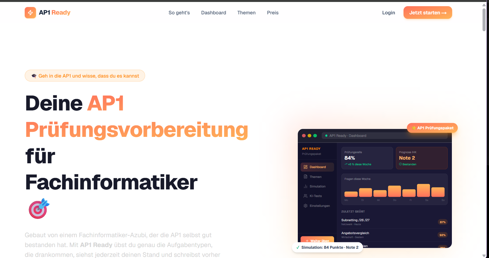
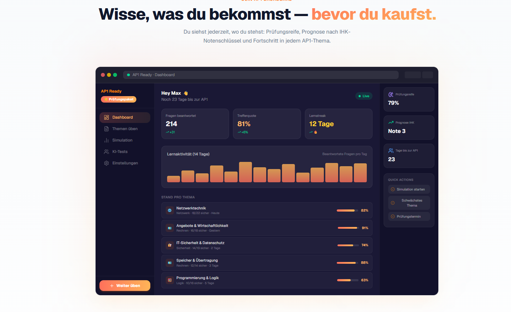

# AP1 Ready

**AP1 Prüfungsvorbereitung für Fachinformatiker (IHK)** · [Live](https://crack-the-test.vercel.app/)

AP1 Ready bereitet Azubis auf die Abschlussprüfung Teil 1 „Einrichten eines IT-gestützten Arbeitsplatzes“ vor, für alle Fachrichtungen. Die Fragen sind nach den Aufgabentypen aufgebaut, die in den AP1-Prüfungen der letzten Jahre immer wieder vorkamen, jeweils mit Rechenweg und Prüfungstipp.

## Funktionen

- **9 AP1-Themen**: Netzwerktechnik, Wirtschaftlichkeit, IT-Sicherheit, Hardware, Speicher & Übertragung, Energie, Programmierung & Daten, Projektmanagement, Kunden & Qualität
- **Fragenbank mit über 140 Aufgaben**: Multiple Choice und Rechenaufgaben mit Toleranz, Erklärung und Tipp
- **Übungsmodus pro Thema** mit gespeichertem Fortschritt
- **90-Minuten-Prüfungssimulation** im AP1-Format (4 Handlungsschritte) mit Notenprognose
- **KI-Übungstests**: 3 kostenlose Tests, serverseitig begrenzt
- **Öffentliche Themenseiten** (`/ap1/[thema]`) mit Beispielfragen für SEO
- **Prüfungspaket**: 15 € einmalig über Stripe, kein Abo

## Tech-Stack

| Bereich | Technik |
|---|---|
| Framework | Next.js 15 (App Router, Server Components, Route Handlers) |
| Sprache / UI | TypeScript, Tailwind CSS 4, DaisyUI |
| Auth & Datenbank | Supabase (Auth, PostgreSQL, Row Level Security) |
| Zahlungen | Stripe Checkout + Webhook |
| KI | Anthropic Claude API |
| Hosting | Vercel (inkl. Cron für Supabase-Keepalive) |
